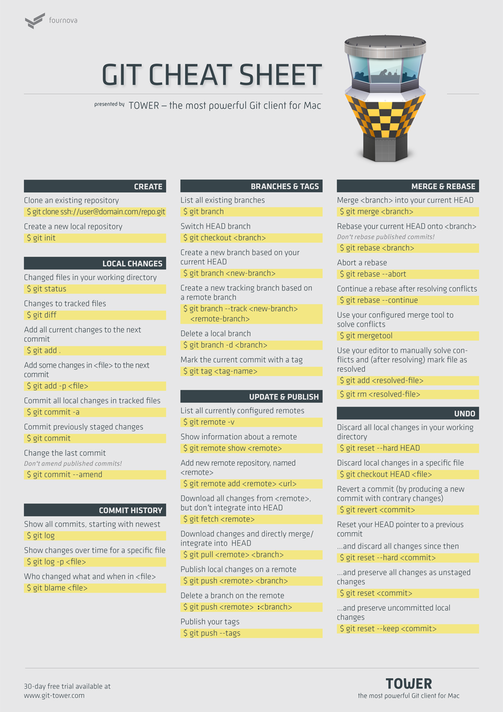

## GIT小抄

**创建**

* 克隆一个现有的存储库
`$ git clone ssh://user@domain.com/repo.git`
* 创建一个新的本地存储库
`$ git init`

**本地更改**

* 在你的工作目录更改文件
`$ git status`
* 更改已追踪的文件
`$ git diff`
* 所有已追踪文件的更改添加到下一个提交
`$ git add .`
* 添加在`<file>`一些变化到下一个提交
`$ git add -P <Files>`
* 提交在追踪文件中的所有本地更改
`$ git commit -a`
* 提交先前暂存区的变化
`$ git commit`
* 更改最后提交说明 \-\-\- *不修改已发布的提交！*
`$ git commit --amend`

**提交历史**

* 显示全部提交，从最新的开始
`$ git log`
* 显示随时间变化的特定文件
`$ git log -P <file>`
* 在<file>里所有提交的更改历史
`$ git blame <file>`

**分支和标签**

* 列出所有现有分支
`$ git branch`
* 切换分支
`$ git checkout <branch>`
* 创建基于您目前的分支一个新的分支
`$ git branch <new-branch>`
* 创建一个基于远程分支一个新的跟踪分支
`$ git branch --track <new-branch> <remote-branch>`
* 删除本地分支
`$ git branch -d <branch>`
* 标记最近提交为一个标签
`$ git tag <tag-name>`

**更新和发布**

* 列出所有当前远程配置
`$ git remote -v`
* 显示有关远程信息
`$ git remote show <REMOTE>`
* 添加新的远程仓库，命名`<REMOTE>`
`$ git remote add <REMOTE> <URL>`
* 从`<REMOTE>`下载的所有更改，但不融入HEAD指向的分支
`$ git fetch <REMOTE>`
* 下载所有更改和直接合并/集成到HEAD指向的分支
`$ git pull <REMOTE> <branch>`
* 上传本地分支修改到远程
`$ git push <REMOTE> <branch>`
* 删除一个远程分支
`$ git push <REMOTE> :<branch>`
* 发布您的标签
`$ git push --tags`

**整合和衍合**

* 合并`<branch>`到当前的HEAD指向的分支
`$ git merge <branch>`
* 衍合你目前的HEAD指向的分支到`<branch>` *不衍合已发布的提交！*
`$ git rebase <branch>`
* 舍弃衍合
`$ git rebase --abort`
* 解决冲突后，继续一个衍合
`$ git rebase --continue`
* 用你的已配置整合工具来解决冲突
`$ git mergetool`
* 使用你的编辑器手动解决冲突（解决后）和标记文件为已解决
`$ git add <resolved-file>`
`$ git rm <resolved-file>`

**取消**

* 放弃工作目录中的所有本地更改
`$ git reset --hard HEAD`
* 丢弃在一个特定的文件的本地更改
`$ git checkout HEAD <file>`
* 还原一个提交（通过产生一个新的提交有不同的变化）
`$ git revert <commit>`
* 你的HEAD指针回退到以前的提交
1. ...放弃所有更改自此提交开始
`$ git reset --hard <commit>`
2. ...保存所有更改为不分级的变化
`$ git reset <commit>`
3. ...保留未提交的本地更改
`$ git reset --keep <commit>`

